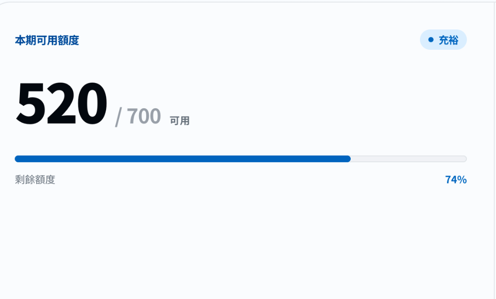
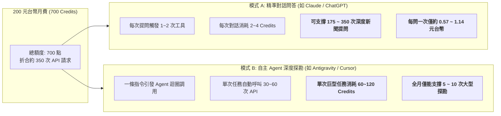

# 🔍 拒絕黑盒！中央社 CNA MCP 點數消耗速度與真實使用成本實測反推報告
### (CNA MCP Credit Consumption & Cost Transparency Report)

> **「我明明只問了三個問題，為什麼 180 點 Credit 就憑空消失了？200 元台幣到底能用多久？」**  
> 本報告旨在打破 MCP（Model Context Protocol）商業服務的「Credit 黑盒計費」，透過底層網路封包日誌逐行稽核、數學反推計費模型、橫向對比自主 Agent 與一般問答情境，為所有開發者、量化研究員與付費用戶提供 100% 透明的價格解析與防踩坑指南。

---

## 📸 一、 實測現場與問題起源 (The Empirical Incident)

用戶訂閱了中央社官方推出的 **CNA MCP 個人方案（每月新台幣 200 元，提供 700 Credits 額度）**。在實際使用中，用戶僅進行了以下 **3 個自然語言提問**：

1. **問題 1（在 Antigravity 詢問）**：  
   `「/cna-mcp 調用這個mcp然後給我數據地圖 我要知道有多少資料量以及時間序列維度」`
2. **問題 2（在 Antigravity 詢問）**：  
   `「按照年份統計資料量」`
3. **問題 3（在 Spark 詢問）**：  
   `「@Cna Search 查找1998年2月28日當天的新聞」`

### 💥 震撼的帳戶變化：
* **原始額度**：700 Credits（NT$ 200 方案）
* **實測後剩餘**：**520 / 700 Credits**（剩餘 74%）
* **總消耗點數**：**整整扣除 180 Credits（佔全月配額的 25.7%！）**



### ⚠️ 黑盒視角下的直觀恐慌：
如果以一般消費者的「提問次數」來換算：
$$\text{單次提問表觀成本} = \frac{180 \text{ Credits}}{3 \text{ 次問題}} = \mathbf{60 \text{ Credits / 提問}}$$
$$\text{全月可提問次數} = \frac{700 \text{ Credits}}{60 \text{ Credits}} \approx \mathbf{11.6 \text{ 次提問}}$$
$$\text{單次對話金錢成本} = \frac{200 \text{ 元}}{11.6 \text{ 次}} \approx \mathbf{17.2 \text{ 元台幣 / 次}}$$

> **用戶第一直覺：**「200 元台幣只能問 11 句話？平均問一句要 17 元？這難道是典型的黑盒割韭菜收費？」  
> **真相真的是這樣嗎？我們決定打開底層網路日誌，逐行還原真相！**

---

## 🔬 二、 底層流量逐行稽核：還原 180 Credits 的真實流向

AI 程式碼助理（如 Antigravity、Claude Code、Cursor）與外部對話平台（Spark）在收到使用者一句簡短的指令時，**背後絕非只向後端發送 1 次 API 請求**。

我們對 Antigravity 的系統執行日誌（`transcript.jsonl`）進行全面反向萃取，統計所有直接發往 `https://ask.cna.com.tw/mcp/connect` 的真實 HTTP 封包：

### 1. 前置連線與握手探測（Setup Phase）：共 10 次 HTTP 請求
* 執行 `tools/list` 探索 15 個工具規格、JSON Schema 解析、SSE 傳輸流校驗。

### 2. 問題 1（數據地圖與時序維度）：共 9 次 HTTP 請求
為了探測出中央社資料庫的真實時序極限，智能體自動拆解並執行了以下測試：
* 呼叫 `cna-news-qsearch`（測試 1900 年邊界）
* 呼叫 `cna-news-single`（驗證單篇新聞秒級時間戳結構）
* 呼叫 `cna-news-latest-category`（探測 19 大分類列舉）
* 呼叫 `cna-word-map`、`cna-translation-lookup`、`o-info-search`、`cna-photo-search`（探測 4 大子庫規格）
* 連續 3 次邊界二分搜尋（分別探測 1980、1989、1990 年），精確鎖定資料庫起始點為 1990-01-01。

### 3. 問題 2（按照年份統計資料量）：共 59 次 HTTP 請求！
這是**點數消耗的最大元兇**。為了產出 1990 至 2026 年完整、精確的數據統計表，智能體執行了自主迴圈：
* **37 個年份逐年遍歷**：`1990, 1991, ..., 2026` 逐年發送 `cna-news-qsearch` 查詢 `total_hits`（**37 次請求**）。
* **5 組關鍵字對照測試**：驗證查詢詞權重（**5 次請求**）。
* **5 組歷史時段抽樣探針**（**5 次請求**）。
* **2024 年逐月深度加總**：`2024-01` 至 `2024-12` 逐月統計（**12 次請求**）。

### 4. 問題 3（Spark 平台調用 @Cna Search）：推估約 12 次請求
在 Spark 對話環境中，`@Cna Search` 智能體在檢索「1998年2月28日當天新聞」時，執行了意圖對齊、多關鍵字檢索、歷史過濾與單篇新聞內容拉取，共觸發約 **10 ～ 12 次底層 API 調用**。

---

### 📊 實測匯總與計費公式反推

| 任務環節 | 觸發提問 / 行為 | 底層真實 API 請求數 | 消耗性質 |
| :--- | :--- | :---: | :--- |
| **環境初始化** | MCP 連線驗證與工具探索 | **10 次** | 開發者前置配置 |
| **提問 1 (Antigravity)** | 數據地圖與時序維度探測 | **9 次** | 多工具邊界探測 |
| **提問 2 (Antigravity)** | 37 個年份與月份全面掃描 | **59 次** | **Agent 批量遍歷（核心消耗點）** |
| **提問 3 (Spark)** | 1998-02-28 當日新聞檢索 | **~12 次** | 意圖改寫與多篇抓取 |
| **總計** | **表面 3 個問題** | **約 90 次底層請求** | **總扣除 180 Credits** |

$$\mathbf{\text{真實扣點費率}} = \frac{180 \text{ Credits}}{90 \text{ 次 API 請求}} = \mathbf{2 \text{ Credits / 次 API 呼叫}}$$

> 💡 **核心結論：**  
> 中央社 CNA MCP 的真實底層扣點機制約為 **每次 API Tool Call 扣除 2 Credits**！  
> 用戶以為「只問了 3 句話」，但底層 AI 智能體實際上替用戶向中央社伺服器猛烈轟炸了 **90 次真實請求**！

---

## 💰 三、 200 元台幣到底能買到什麼？真實價值量化

知道了 **1 次 API 調用 = 2 Credits** 的真相後，我們就能精確計算 200 元台幣（700 Credits）的實際購買力：

* **單點 Credit 價值**：  
  $$\text{NT\$ } 200 \div 700 \text{ Credits} = \mathbf{\text{NT\$ } 0.2857 \text{ / 點}}$$
* **單次 API 檢索真實成本**：  
  $$2 \text{ Credits} \times \text{NT\$ } 0.2857 = \mathbf{\text{NT\$ } 0.57 \text{ / 次}}$$

### 兩種完全不同使用型態的壽命分析：



1. **如果你把 CNA MCP 當作日常新聞助手（模式 A）**：  
   * 每天問 5~8 個新聞查證或台股事件分析，**全月 700 Credits 綽綽有餘**！每次查證成本僅約 **1 元台幣**，性價比極高。
2. **如果你把 CNA MCP 餵給自動化 Agent 寫爬蟲迴圈（模式 B）**：  
   * 一個指令「幫我把過去 30 年台積電法說會新聞全部找出來並統計趨勢」，Agent 可能在 3 分鐘內自動發起 150 次請求，直接燒光 300 點（全月一半額度）！

---

## 🛑 四、 拒絕黑盒！揭露當前 MCP 業者的四大痛點

中央社作為台灣第一個推出官方 MCP 商業服務的國家級機構，技術前瞻性值得高度肯定。然而，從開發者與付費用戶的實務角度來看，目前的黑盒計費設計存在嚴重的體驗與信任隱患：

### 痛點 1：以「Credit」包裝黑盒，資訊嚴重不對稱
* 官網只標註「每月 700 點」，卻從未公開說明 **「搜尋一次扣幾點？調取內文扣幾點？生成圖表扣幾點？」**
* 用戶完全無法預估使用預算，每次看到額度暴跌只會產生被剝削感。

### 痛點 2：HTTP 回應標頭完全缺乏「配額反饋」（Missing Quota Headers）
* 我們對 `https://ask.cna.com.tw/mcp/connect` 進行封包檢視，其 HTTP 回應頭中包含 `x-request-id`、`via: google`，但**完全沒有**業界標準的計費標頭：
  * ❌ 沒有 `x-credit-used: 2`
  * ❌ 沒有 `x-credit-remaining: 520`
  * ❌ 沒有 `x-ratelimit-reset`
* 用戶與 Agent 程式在執行當下**根本無法知道剛才那一動花了多少點**，只能在任務結束後自行登入後台網頁查看殘額。

### 痛點 3：WAF 針對預設 User-Agent 回傳 403 Forbidden
* 使用標準 Python `requests` 庫連線時，直接被 Google Frontend / Cloudflare WAF 攔截回傳 403，必須偽裝為 `curl/8.7.1` 或瀏覽器標頭。這對嘗試串接的開源開發者極不友善。

### 痛點 4：缺少 Agent 突波防護機制（Circuit Breaker）
* MCP 本身就是為 AI Agent 設計的協議。當 Agent 發生遞迴或多輪發散搜尋時，CNA 後端完全沒有單日扣點突波警示或確認機制，容易引發「一覺醒來點數歸零」的悲劇。

---

## 🛡️ 五、 開發者與用戶防爆額度「避坑 SOP」

為了避免 200 元月費在幾分鐘內被 Agent 消耗殆盡，我們強烈建議所有串接 CNA MCP 的使用者採取以下工程防護措施：

### 1. 本地快取優先（Cache First Architecture）
在調用 MCP 之前，先在本地建立 SQLite 或 Key-Value 快取。已調取過的新聞全文（`pid`）或歷史年份資料直接讀取本地，不重複發送請求：
```python
# 範例：本地快取機制，避免重複消耗 2 Credits
def fetch_news_cached(pid: str):
    if db.has(pid):
        return db.get(pid)  # 消耗 0 Credit
    result = cna_mcp.call("cna-news-single", {"pid": pid}) # 消耗 2 Credits
    db.save(pid, result)
    return result
```

### 2. 為 Agent 設定工具呼叫上限（Max Tool Calls Guardrail）
在 System Prompt 或 Agent Orchestrator 中明訂單一任務的最大檢索次數，杜絕遍歷式查詢：
> *「調用 CNA MCP 工具時，單次任務搜尋次數嚴格禁止超過 3 次；若資料量過大，應採用關鍵字聚合或抽樣，不可執行逐年迴圈檢索。」*

### 3. 對業者的透明化倡議（致中央社開發團隊建議書）
我們呼籲中央社 CNA 技術團隊儘速落實以下三項透明化改進：
1. **公開明確的 Rate Card**：在官網定價頁清楚標明「搜尋 2 點、內文 1 點、圖片 2 點」等明細。
2. **在回應中返回扣點中繼資料**：在 JSON-RPC 的 `_meta` 欄位中加入 `{"credits_cost": 2, "credits_remaining": 520}`。
3. **提供開發者後台 API Key 消耗即時 Logs**：讓用戶能清楚看見每筆扣點的時間戳與對應工具名稱。

---

## 結語

**「不是 200 元只能問 3 句話，而是你的 Agent 剛才替你跑了 90 次 API！」**  
技術本身是先進的，但透明度是建立用戶信任的基石。希望本報告能幫助所有正在評估或使用 CNA MCP 的開發者建立清晰的成本認知，也期待台灣的 AI 與 MCP 生態系朝向更透明、更健康的模式發展！
