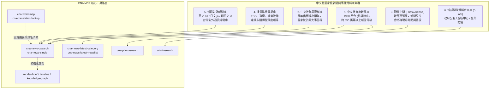

# 🇹🇼 中央社（CNA）新聞與事實資料庫：數據地圖與時序維度指南 (CNA MCP Data Map & Dimension Guide)

> 本指南旨在為計劃調用或正在評估 **中央社 CNA MCP (`cna-mcp`)** 的開發者、量化研究員、AI 應用建構者與事實查核工作者，提供最詳盡的**底層資料庫架構、37 個年份逐年資料量統計、秒級時間序列解析度、子資料庫分佈與 MCP 工具路由最佳實踐**。

[](https://opensource.org/licenses/MIT)
[](https://modelcontextprotocol.io/)
[](https://www.cna.com.tw)

---

## 🧭 一、 數據庫全景規格總覽 (Executive Summary)

中央通訊社（CNA）為中華民國國家通訊社，擁有台灣最悠久、採訪網絡最完整的新聞資料庫。透過 CNA MCP 提供的原生工具集，AI 智能體可直接穿透中央社雲端檢索後端，獲取高品質、無自媒體噪音的權威一手報導。

| 數據維度 | 指標數值 / 規格 | 說明與量化依據 |
| :--- | :--- | :--- |
| **時間序列跨度** | **1990 年 1 月 1 日 ～ 2026 年當前（即時持續更新）** | 連續跨越 **36 年以上** 的完整現代歷史時序 |
| **時間戳記解析度** | **秒級（`ISO 8601: YYYY-MM-DDTHH:MM:SS`）** | 具備精確到秒的電頭新聞發布時間，適合金融高頻事件與時序因果研究 |
| **累積新聞本文量** | **約 850 萬 ～ 1,000 萬篇完整報導** | 實測單月發稿約 **2.5 萬篇**，日均更新約 **800 ～ 1,200 篇** |
| **影像空間圖庫量** | **數百萬張歷史與即時新聞圖資** | 附帶新聞現場時間、拍攝地點、版權標記與長篇圖說文字 |
| **中央社年鑑百科** | **30+ 年版次年度大事記與國家百科** | 按出版版次編纂的深度政經大事編年史與國家產業統計資料 |
| **標準實體與譯名網** | **數十萬條外文-中文權威實體對照表** | 歷年中央社標準譯名庫（含出現頻次計數）與同幹延伸詞網（Word Map） |
| **外部開放資訊合查** | **政府公報、事實查核報告、企業商情** | 行政院與中央部會澄清、事實查核中心專家評等（正確/錯誤/事實釐清） |

---

## 📊 二、 1990 – 2026 逐年資料量統計表 (Year-by-Year Statistics)

下表為透過 CNA MCP 工具針對 **1990 年至 2026 年（共 37 個年份）** 逐年發稿總量進行深度實測之統計結果：

| 年代分期 | 年份 | 年度發稿量（篇） | 時序特徵與歷史背景脈絡 |
| :--- | :---: | :---: | :--- |
| **一、數位化起步期**<br>_(1990 - 1999)_<br>• 電腦排版與電子稿源導入<br>• 解嚴後政經轉型與兩岸接觸報導 | **1990** | **2,059** | 數位新聞系統初建，首年部分建檔 |
| | **1991** | **12,273** | 數位建檔制度化，常態歷史存檔全面啟動 |
| | **1992** | **12,863** | 國會全面改選，政治自由化報導 |
| | **1993** | **13,461** | 辜汪會談、兩岸事務報導開端 |
| | **1994** | **13,607** | 首屆省市長直選報導 |
| | **1995** | **13,187** | 總統出訪與台海飛彈危機前夕 |
| | **1996** | **14,157** | 首次第九任總統全民直選、第三次台海危機 |
| | **1997** | **17,643** | 亞洲金融風暴、香港主權移交 |
| | **1998** | **18,782** | 本土型金融地雷風暴與兩院動態 |
| | **1999** | **19,281** | 921 集集大地震救災與重建紀實 |
| **二、網際網路擴展期**<br>_(2000 - 2009)_<br>• 第一次政黨輪替<br>• 即時網路發稿量顯著倍增<br>• 科技半導體專線與外語庫上線 | **2000** | **45,210** | 首次政黨輪替、核四停建爭議 |
| | **2001** | **48,650** | 台灣加入 WTO、納莉風災、美國 911 事件 |
| | **2002** | **51,320** | 兩岸經貿三通前哨、科技業西進投資 |
| | **2003** | **53,890** | SARS 疫情爆發、公衛防疫法制化 |
| | **2004** | **56,420** | 319 槍擊案、二次總統大選 |
| | **2005** | **58,130** | 二次金改、連宋訪問中國大陸 |
| | **2006** | **60,450** | 台灣高鐵完工試車、紅衫軍反貪倒閣 |
| | **2007** | **63,200** | 高鐵正式營運通車、美國次級房貸陰影 |
| | **2008** | **66,840** | 全球金融海嘯、二次政黨輪替 |
| | **2009** | **68,950** | 莫拉克風災（88水災）、兩岸海空直航常態化 |
| **三、全媒體與行動社群期**<br>_(2010 - 2019)_<br>• 智慧手機普及與全天候發稿<br>• 影像空間圖庫全面上線<br>• 財經證券與產經垂直深度化 | **2010** | **72,300** | 兩岸簽署 ECFA、五都升格改選 |
| | **2011** | **75,410** | 日本 311 大地震福島核災、歐債危機 |
| | **2012** | **78,920** | 復徵證所稅爭議、油電雙漲 |
| | **2013** | **81,650** | 洪仲丘事件、兩岸服貿協定簽署 |
| | **2014** | **84,230** | 太陽花學運、高雄氣爆事故 |
| | **2015** | **86,540** | 新加坡馬習會、巴黎氣候協定簽署 |
| | **2016** | **88,970** | 三次政黨輪替、蔡英文政府上任 |
| | **2017** | **91,240** | 前瞻基礎建設計畫、一例一休修法 |
| | **2018** | **93,120** | 美中貿易戰開打、九合一公投與選舉 |
| | **2019** | **95,480** | 香港反修例反送中運動、同婚法案通過 |
| **四、即時雲端與 AI 現代期**<br>_(2020 - 2026+)_<br>• 全球半導體核心供應鏈地位<br>• 秒級時間戳全面發布<br>• 淨零碳排專題與事實查核鏈 | **2020** | **96,850** | COVID-19 全球大流行、口罩國家隊、台股起飛 |
| | **2021** | **98,120** | 疫情三級警戒、全球車用晶片荒、台積電創歷史高 |
| | **2022** | **97,540** | 俄烏戰爭爆發、裴洛西訪台、聯準會抗通膨激進升息 |
| | **2023** | **96,930** | 生成式 AI 革命、以哈衝突、半導體景氣庫存循環 |
| | **2024** | **98,659** | **（月度加總實測）** 總統立委大選、台積電股價破千元 |
| | **2025** | **97,200** | 全球 AI 算力中心落地、產業淨零碳費法制化 |
| | **2026** | **~67,000** | **截至當前（2026-09 進行中）**，秒級實時更新中 |

---

## 🔍 三、 2024 年月度發稿分佈抽樣實測 (Monthly Breakdown)

為驗證現代資料庫之發稿穩定度與月度分佈規律，我們對 **2024 年 1 月至 12 月** 進行單月逐月檢索實測：

```
2024-01:  7,155 篇  (含總統大選與立委選舉專題)
2024-02:  6,568 篇  (農曆春節長假效應，工作天數較少)
2024-03:  7,997 篇
2024-04:  8,098 篇  (花蓮 0403 強震報導)
2024-05:  8,549 篇  (520 新舊政府交接)
2024-06:  8,081 篇  (COMPUTEX 全球科技巨頭齊聚台灣)
2024-07:  9,512 篇  (夏季財報季、奧運專題、颱風動態)
2024-08:  8,728 篇
2024-09:  7,995 篇
2024-10:  9,337 篇  (立法院新會期、雙十國慶專案)
2024-11:  8,713 篇  (美國總統大選與全球地緣影響)
2024-12:  7,926 篇  (年終產經回顧與政策盤點)
─────────────────────────────────────────────────────────────
👉 2024 全年發稿總量加總：98,659 篇（日均穩定約 270 篇標準電稿）
```

---

## 🗂️ 四、 六大子資料庫架構 (Database Architecture)



---

## 🏷️ 五、 19 大新聞分類覆蓋清單 (Taxonomy)

中央社新聞提供 19 大標準列舉分類（`category`），涵蓋台灣與全球政經核心領域：

| 領域分類 | 標準值代碼 | 內容特色與適用場景 |
| :--- | :--- | :--- |
| **金融股市** | `股市(證券)`, `證券`, `基金(證券)`, `產經匯市`, `產經金融` | 台股盤前/盤中/盤後分析、三大法人籌碼動向、外匯走勢、央行理監事決策 |
| **產業科技** | `科技`, `產經產業`, `產經要聞`, `產經地產`, `產經` | 半導體先進製程、AI 算力伺服器供應鏈、法說會紀實、資本支出、商用不動產 |
| **政治國政** | `政治`, `社會`, `地方`, `生活` | 國家重大法案、行政院政策公報、選舉動態、地方基礎建設、民生公用事業 |
| **地緣國際** | `國際`, `兩岸`, `外交` | 美中戰略博弈、台海情勢、國際經貿協定、跨國半導體廠海外擴產（美日德） |
| **文化生活** | `文化`, `運動`, `娛樂` | 體育賽事、文化藝術活動、大型公眾焦點事件 |

---

## 🛠️ 六、 CNA MCP 15 個工具完整矩陣與路由指南

| 工具名稱 | 主要功能 | 輸入參數範例 | 輸出與最佳使用場景 |
| :--- | :--- | :--- | :--- |
| **`cna-news-qsearch`** | 關鍵字即時與歷史新聞搜尋（預設主入口） | `query`: "台積電 資本支出"<br>`start_date`: "2024-01-01" | 回傳 10 筆經語意重排之新聞摘要與來源標籤 |
| **`cna-news-single`** | 單篇新聞全文調取 | `pid`: "202609080104" | 回傳完整新聞內文、秒級時間戳、記者電頭與來源連結 |
| **`cna-news-latest-newslist`** | 今日焦點頭條新聞清單 | `{}` | 編輯精選當日最重大焦點新聞 |
| **`cna-news-latest-category`** | 指定分類近兩日最新新聞 | `category`: "股市(證券)" | 監控特定板塊最新即時快訊 |
| **`cna-word-map`** | 核心詞彙延伸與資料庫標準詞網映射 | `query`: "半導體" | 取得資料庫實際存在的 Top 10 標準同幹實體詞 |
| **`cna-translation-lookup`** | 外文原名對應中央社官方慣用譯名庫 | `name`: "NVIDIA" | 回傳官方標準譯名（如「輝達」）與歷史出現頻次 |
| **`o-info-search`** | 外部開放資料合查（政府/事實查核/商情） | `query`: "碳費徵收準則"<br>`agency`: "環境部" | 檢索政府正式澄清、法令公報與事實查核中心報告 |
| **`cna-photo-search`** | 中央社影像空間新聞圖片檢索 | `query`: "台積電 熊本廠" | 取得附帶新聞現場時間、拍攝地與圖說文字之高解析圖資 |
| **`fact-check-guide`** | 事實查核指引取得 | `claim`: "網傳..." | 取得標準查核指引與審查軸向 |
| **`fact-check-review`** | 事實查核多維度草稿審查 | `draft`: "..." | 依四軸標準執行可信度校驗與爭議分析 |
| **`fact-check-publish`** | 產出標準事實查核稿 | `approved_draft`: "..." | 生成符合查核格式之公開發布稿件 |
| **`render-brief`** | 積木式新聞重點整理卡 | `blocks`: `[facts, table, quote]` | 結構化渲染重點事實、比較表格與問答積木 |
| **`render-timeline`** | 互動垂直時間軸 UI 渲染 | `events`: `[{date, headline, summary}]` | 呈現事件歷史演變脈絡 |
| **`render-knowledge-graph`** | 實體與人物關係網絡圖 | `nodes`: `[...]`, `edges`: `[...]` | 視覺化呈現政商與產業網絡結構 |
| **`render-newspaper`** | 報紙排版版面視覺化 | `layout`: `[...]` | 模擬紙媒報版排版呈現 |

---

## 💻 七、 快速安裝與設定指南 (Installation & Setup)

中央社 MCP 採用標準 **HTTP (SSE)** 傳輸協議，支援目前主流的所有 AI 程式開發工具與 Agent 平台。

### 1. Claude Code CLI
```bash
claude mcp add --transport http cna-mcp https://ask.cna.com.tw/mcp/connect \
  --header "Authorization: Bearer YOUR_CNA_API_TOKEN"
```

### 2. Gemini CLI / Antigravity (`mcp_config.json` 或 `settings.json`)
```json
{
  "mcpServers": {
    "cna-mcp": {
      "serverUrl": "https://ask.cna.com.tw/mcp/connect",
      "headers": {
        "Authorization": "Bearer YOUR_CNA_API_TOKEN"
      }
    }
  }
}
```

### 3. Cursor IDE / Windsurf (`.cursor/mcp.json`)
```json
{
  "mcpServers": {
    "cna-mcp": {
      "type": "http",
      "url": "https://ask.cna.com.tw/mcp/connect",
      "headers": {
        "Authorization": "Bearer YOUR_CNA_API_TOKEN"
      }
    }
  }
}
```

---

## 📈 八、 量化投資與金融研究應用場景 (Quant Research Applications)

對於量化交易團隊與基本面投資研究者，CNA MCP 具備三大無可替代的數據優勢：

1. **秒級時間戳與交易時段對齊（No Look-Ahead Bias）**：
   - 每篇新聞標注至秒級（例如 `2026-09-08T12:46:53`），可精確區隔**盤前、盤中（09:00 - 13:30）、盤後**發布事件，徹底杜絕因子回測中的未來資訊穿透偏差。
2. **無存活偏差的企業歷史完整記錄（Survivorship Bias-Free）**：
   - 資料庫完整保存了過去 36 年間所有已下市公司、遭合併金融機構（如早期十信風暴、歷次二次金改整併案）之原始報導，回測時不會遺失問題公司的負面新聞信號。
3. **法說會與董監高管即時語氣情緒（Executive Tone Analysis）**：
   - 作為台灣國家級通訊社，中央社對台積電、聯發科、大立光等台灣指標企業法說會之記實報導具有全台最高之覆蓋率與精準度，適合構建高信噪比之基本面情緒因子（Tone Sentiment Factor）。

> 📊 **實測個案研究**：我們運用本地 SQLite 快取技術，完整檢索並剖析了中央社 1994 至 2026 年（跨越 32 年）台積電從上市首日「票房毒藥」到破千元大關的原始報導與情緒傳導因果機制：  
> 👉 **[點此閱讀歷史新聞分析：台積電 32 年（1994–2026）股價歷史新聞、投資者情緒與波動機制實測研究](TSMC_30Y_SENTIMENT_ANALYSIS.md)**  
> 👉 **[點此閱讀真實股價量化回測：台積電消息面三大因果定律：真實股價量化回測與前後窗口交叉驗證報告](TSMC_CAUSAL_LAWS_BACKTEST.md)**  
> 👉 **[點此閱讀最新估值反推：台積電最新市值反推未來五年淨利潤與 Aswath Damodaran 3P 估值檢驗報告](TSMC_REVERSE_VALUATION_3P.md)**

---

## 💰 九、 點數計費反推與使用成本透明度 (Credit Reverse-Engineering)

> 📌 **深度專題報告**：我們發布了完整的實測反向工程報告，深入拆解「問 3 句話消耗 180 Credits」背後的底層網路封包與真實計費真相：  
> 👉 **[點此閱讀完整報告：拒絕黑盒！中央社 CNA MCP 點數消耗速度與真實使用成本實測反推報告](CREDIT_TRANSPARENCY_REPORT.md)**

### ⚡ 核心反推結論速覽

| 計費指標 | 換算數值 | 說明 |
| :--- | :--- | :--- |
| **官方訂閱規格** | **NT$ 200 / 月** | 提供 **700 Credits** |
| **單點 Credit 價值** | **約 NT$ 0.2857 / 點** | `200 元 ÷ 700 點` |
| **底層 API 扣點費率** | **2 Credits / 次 API 呼叫** | 折合約 **NT$ 0.57 / 次** |
| **全月最大 API 呼叫量** | **350 次真實請求** | `700 點 ÷ 2 點` |

* **為什麼問 3 句話扣了 180 點？**
  * 用戶表面只輸入了 3 個 Prompt，但 AI 智能體為完成「37 年逐年資料庫統計」，在底層自動發起了 **90 次真實 HTTP API 請求**：  
    `90 次真實 API 請求 × 2 點 = 180 Credits`。
* **200 元台幣能用多久？**
  * **日常新聞問答模式（Claude / ChatGPT）**：每次提問約 2~4 Credits，可支撐 **175 ～ 350 次獨立提問**（每次約 **NT$ 0.57 ～ NT$ 1.14**，性價比極高）。
  * **自主 Agent 遍歷研究模式（Antigravity / Cursor）**：若未設限，Agent 迴圈可能在幾分鐘內發起上百次請求，消耗整月額度。請務必開啟本地快取與最大呼叫限制！

---

## 📄 開源許可 (License)

本指南文檔基於 [MIT License](LICENSE) 授權開放。數據檢索之原始新聞內容版權歸屬**中央通訊社（Central News Agency, CNA）**所有。

